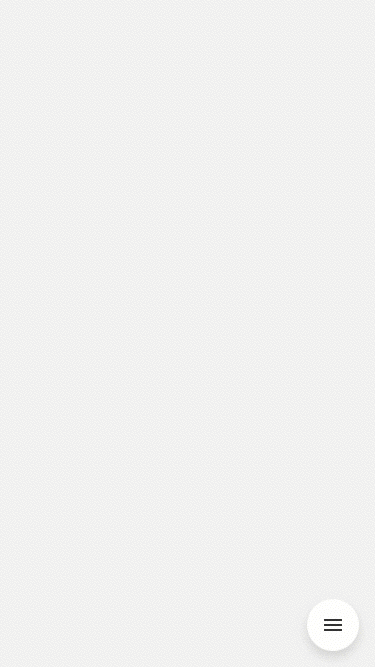

[](http://ego-cms.com/?utm_source=github)

# CircleMenu
======================================================

## Table of contents
* [Introduction](../..#introduction)
* [Requirements](../..#requirements)
* [Documentation](../..#documentation)
* [Sample](../..#sample)

&nbsp;&nbsp;&nbsp;

Introduction
-----------

**CircleMenu** - this is a simple menu that contains buttons that are arranged in a circle one by one. It supports left/right/up/down swipes on both platforms. 
Every button can contain submenu, with other buttons. Submenu buttons have two states: open and close. In close state submenu buttons are invisible and the parent button has a blue indicator. If submenu buttons are in the opened state they are located near parent button (relative to each other they are located one above the other with an indicator on the top). For changing state you should tap on the base button which contains the submenu.
Menu buttons move by a circular arc with a center in the center of the main menu. Menu buttons have static positions on the screen. The angle between positions is 40 degrees. Scrolling menu implemented by an arc from one to other static positions. Every movement around has a spring/bounce animation at the end. Open and close animations move to static positions too, but unlike the scroll, each menu moves across several static positions (the first menu moves across all positions to the end, next menu moves across all positions, excepts last position and etc).

Requirements
-----------
- iOS 11.4 and higher

Documentation
-----------
      
**Properties**
* unfocusedBackgroundColor: UIColor - button's background color in the regular state.
* focusedBackgroundColor: UIColor - button's background color in the pressed state.
* unfocusedIconColor: UIColor - button's icon color in the regular state.
* focusedIconColor: UIColor - button's icon color in the pressed state.
* circleMenuItems: [CircleMenuItemModel] - this property contains sequence of the models for buttons.

**Methods**
* attach(viewController: UIViewController) - adds the menu to the bottom right corner of the view for current viewController 

**Limitations**

The general circle menu must contain from 3 to 9 buttons. Each submenu should contain from 1 to 5 buttons.
We compute the menu frame from the general View of the UIViewController. This means that if you want to install banner ads at the bottom of the screen, you would see menu button above your banner.
CircleMenuItemModel has initializer which includes id, icons source and an array of submenus if they exist. In this case user should generate unique id because button menu clicked identification implemented by using id. TouchUpInside event handler delegate must be conformed with CircleMenuDelegate protocol and must override menuItemSelected(id: Int) method, where id is button menu identifier. 

Circle menu uses native spring animation effects. We use UIView with a clear background to place all menu buttons. But it will not be a problem for using views that placed under the circle menu view, because we overrode the hitTest(:CGPoint,:UIEvent?) method. We use only 6 physical buttons with caching for performance purpose. We use Lottie animation for the hamburger button.

**Hamburger main button has id = 100 by default**

**Models**
```swift
public class CircleMenuItemModel {
    public var id: Int?
    public var imageSource: UIImage?
    public var children: [CircleMenuItemModel]?
    public var hasChildren: Bool

    public init()
    public init(id: Int?, imageSource: UIImage?, children: [CircleMenuItemModel]? = nil)
}
```

Sample
-----------

```swift
class ViewController: UIViewController, CircleMenuDelegate {
    var icons = [String]()
    let submenuIds = [2,3]

    override func viewDidLoad() {
        super.viewDidLoad()

        icons.append(contentsOf: ["icImage", "icPanorama", "icVideo",
        "icPhoto","icTimelapse","icMacro", "icPortrait", "icSeries", "icTimer",
        "icSixteenToNine", "icOneToOne", "icHDR"])

        let circleMenu = CircleMenu()
        circleMenu.attach(to: self)
        circleMenu.delegate = self

        //here you can customize needed properties
        circleMenu.circleMenuItems = createCircleMenuItems(count: 4)
        circleMenu.focusedIconColor = UIColor.red
        circleMenu.unfocusedIconColor = UIColor.green
        circleMenu.focusedBackgroundColor = UIColor.black
        circleMenu.unfocusedBackgroundColor = UIColor.yellow
    }

    func menuItemSelected(id: Int) {
        //your click event handler
    }

    private func createCircleMenuItems(count: Int) -> [CircleMenuItemModel] {
        var menuModels = [CircleMenuItemModel]()
        for i in 0..<count {
            let menuModel = CircleMenuItemModel(id: i, imageSource: UIImage.init(named: icons[i]))
            if submenuIds.contains(i){
                for j in  9..<12 {
                    let submenuModel = CircleMenuItemModel(id: j, imageSource: UIImage.init(named: icons[j]))
                    menuModel.children!.append(submenuModel)
                }
            }
            menuModels.append(menuModel)
        }
        return menuModels
    }
}
```

[](LICENSE)